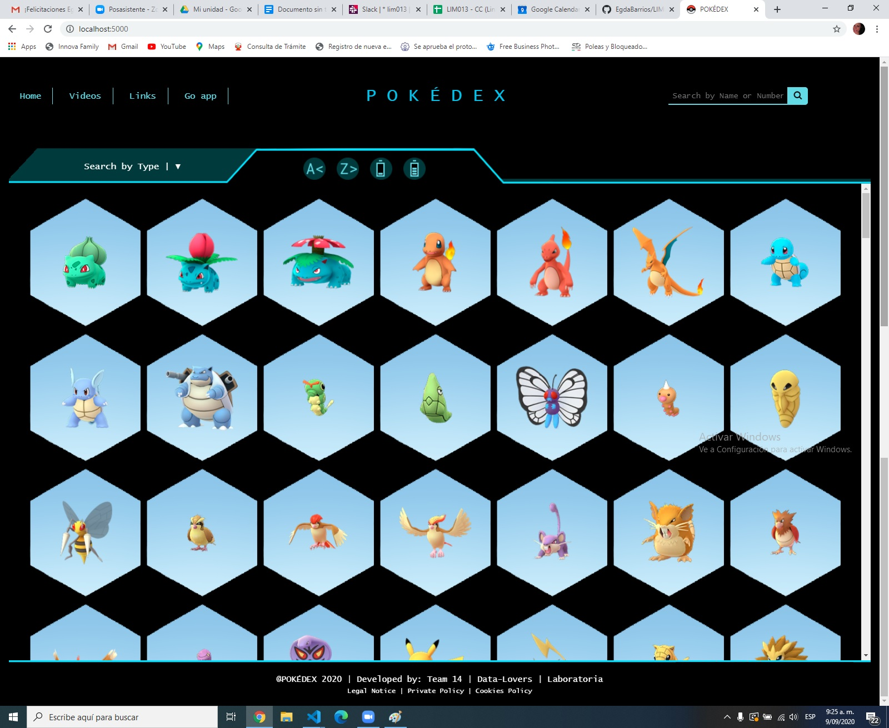
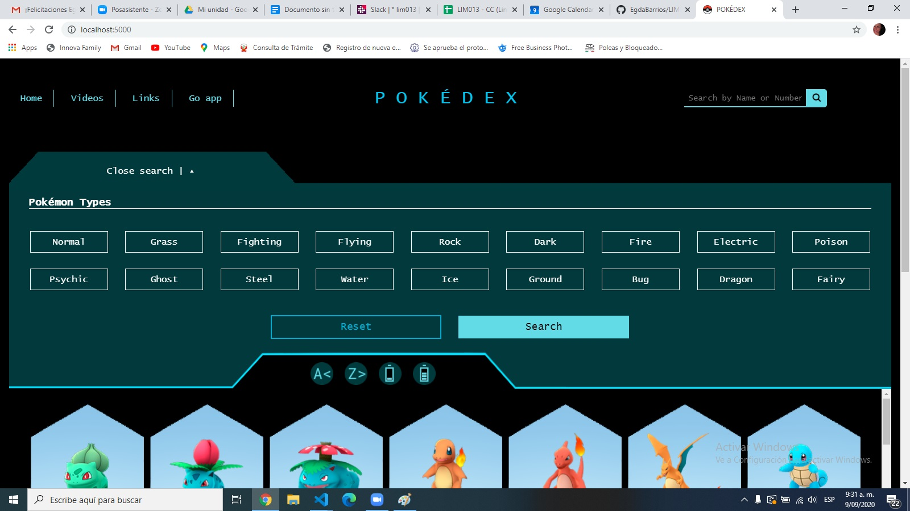
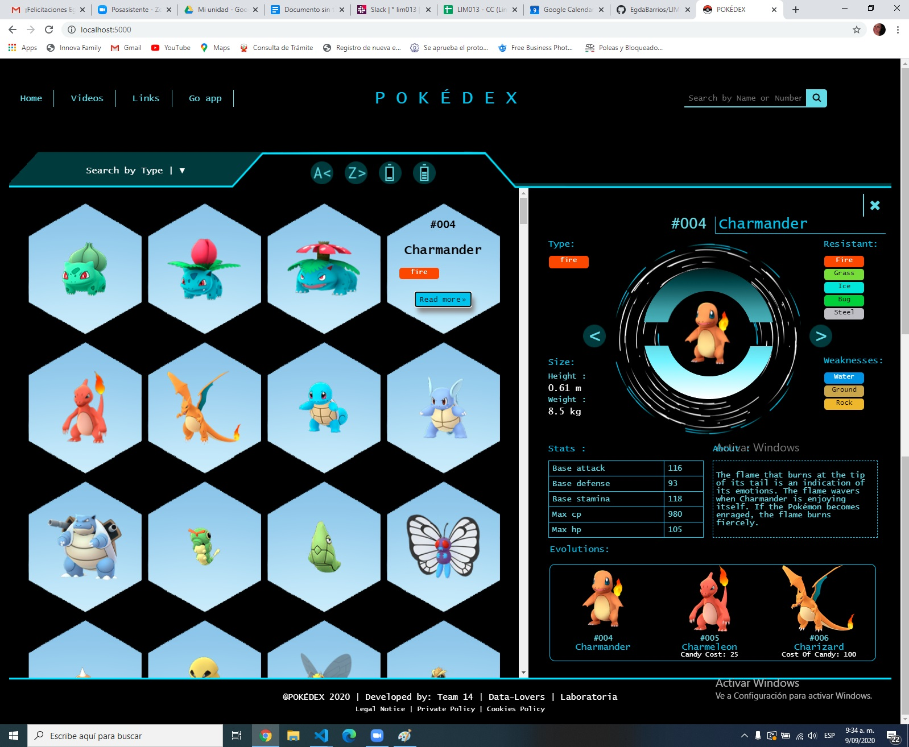
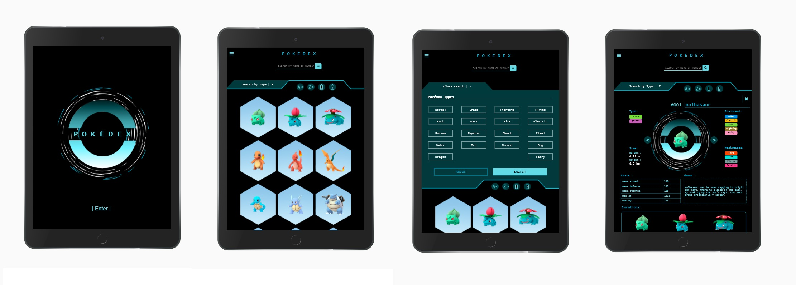
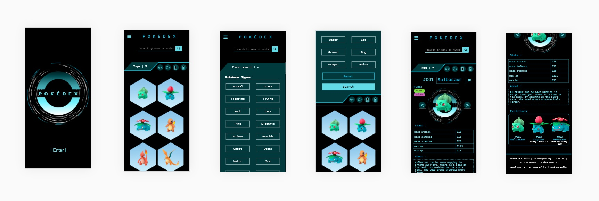

# POKÉDEX. Data escogida: POKÉMON 

## 1. Ejercicio a desarrollar

Interfaz de usuario en función a una Base de Datos suministrada.

## 2. Resumen del proyecto

Página web POKÉDEX, donde el usuario (jugador de la app Pokémon Go) podrá visualizar, buscar, e interactuar con la información necesaria a la hora de escoger los personajes que integrarán su equipo y así ganar la(s) batalla(s) contra otro(s) "entrenador(es)".

### Definición del producto

Iniciamos realizando una encuesta al usuario objetivo para conocer tanto sus necesidades como sus estrategias, de manera de poder desarrollar un producto capaz de satisfacerlas. (Enlace:
https://docs.google.com/forms/d/14CkMw0mnuVfLxTn-C_Vaui2eQLNA8Q0KiS8fswzEhWo/edit?ts=5f32c74f).

Una vez analizada la data, planteamos nuestras Historias de usuario, de acuerdo a las cuales planificamos su implementación. (Enlaces: https://trello.com/b/r0DujdY4 ; https://docs.google.com/spreadsheets/d/1bW6udeKvTBkZCFtt94m5wwy2nXC1ITs6LFBFT76I72E/edit?usp=sharing).

Teniendo en cuenta lo anterior, dimos inicio al diseño de la primera interfaz con el prototipo en papel (baja fidelidad):  
![] (images/Propotipo papel - baja fidelidad.JPG)

El cual sometimos a feedback y pulimos hasta obtener el prototipo de alta:
![] (images/Propotipo Figma - alta fidelidad.JPG)

Con toda esta información sobre la mesa, continuamos con la implementación de nuestra página web dirigida a usuarios que ya conocen y juegan Pokémon Go. 

### Diseño de la Interfaz de Usuario

En ella se presenta la información básica y detallada de los diferentes personajes, con una interfaz llamativa inspirada en las pantallas de alta definicón de los centros Pokémon (Pokémon Center) en Japón, que invita a interactuar libremente sobre ella. 

En primera instancia se muestra una lista de personajes con sus carácterísticas básicas (imágen, número, nombre y tipo), posibilitando acceder a información más detallada de cada uno de ellos (desbilidades, tamaño, descripción, estadísticas, evoluciones);  otra pestaña, en este caso desplegable, permite filtrar data en base a la condición de tipo; un campo (input) facilita la búsqueda de los personajes digitando su número y nombre; y haciendo "click" en cuatro botones gráficos, es posible ordenarlos en forma ascendente y descendente, tanto alfabéticamente, como por la cantidad de su poder. 

De acuerdo a nuestra investigación, la mayoría de usuarios utiliza dispositivos móviles, por lo que hemos implementado la teoria de "mobile first"; a la hora de diseñar la versión del desktop hemos decidido cambiar el formato de la interfaz sacando provecho a todo el ancho de la pantalla, compartiéndola.

### Historias de usuario

1. Yo como jugador Pokémon Go, quiero ver el número, nombre e imagen de todos los pokemones, para poder seleccionar el pokémon de mi interés y del cuál quiero tener más infomación.

2. Yo como jugador Pokémon Go, quiero ver mas información del pokémon que seleccione, para informarme sobre cada uno y poder tomar la decisión de cuales son los mas adecuados para mis batallas.

3. Yo como jugador Pokémon Go, quiero poder ordenar los pokemones alfabéticamente tanto ascendente (A-Z), como descendente (Z-A), para poder encontrarlos más rápido.

4. Yo como jugador Pokémon Go, quiero poder buscar los pokemones por nombre o número (Pokedex Nacional), para poder encontrar más rápido un pokémon en específico.

5. Yo como jugador de Pokémon Go, quiero que los pokemones esten organizados por tipo (fuego, sinientro,veneno), para poder armar mi equipo y variar los tipos de pokemones que lo integrarán.

6. Yo como jugador Pokémon Go, quiero poder ordenar los pokemones por  promedio de estadísticas , para poder encontrar los mas fuertes primero.

### Tests de usabilidad

* En el prototipo inicial el logo tenía un fondo y mayor dimensión. En un feedback, recomendaron bajarle la intensidad, para no competir y/o distraer del resto de la información.

* Un usuario recomendó hacer los botones gráficos aún más descriptivos, por lo que implementamos un pequeño aviso descriptivo (tooltip) al hacer pasar el mouse (hoover) sobre ellos.

* Otro usuario que tuvo la oportunidad de "jugar" con la interfaz, sugirió que se podría implementar el acceso a la información de las evoluciones haciendo "click" en su imágen.

* Adicionalmente, nos hicieron la observación de mejorar el mensaje de error retornado a la hora de filtrar por tipo (alert). En consecuencia, implementamos un modal más afin con el resto del diseño.

* En general, recibimos buenas opiniones sobre la apariencia y funcionamiento de la interfaz.
