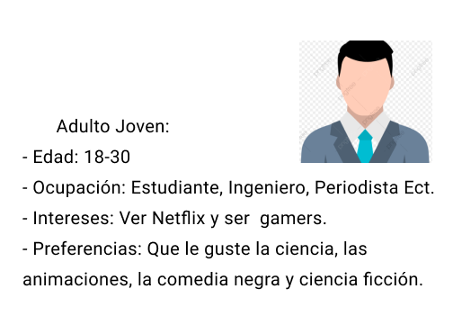
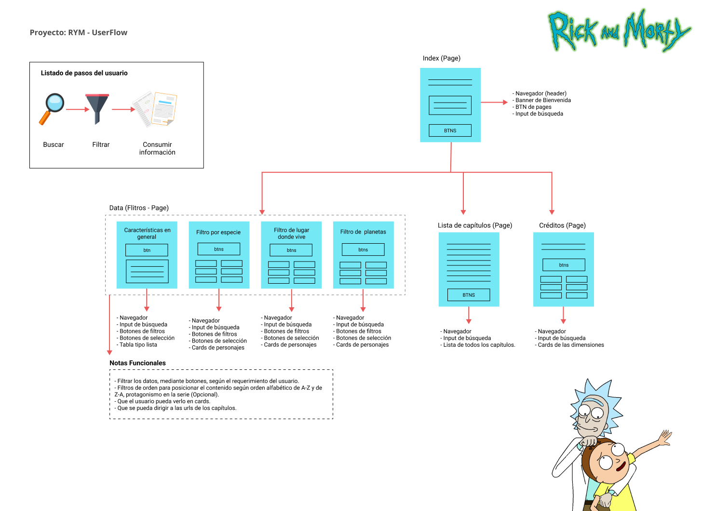
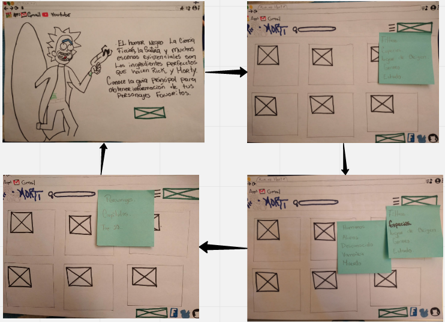
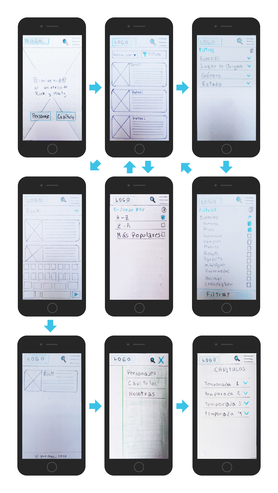
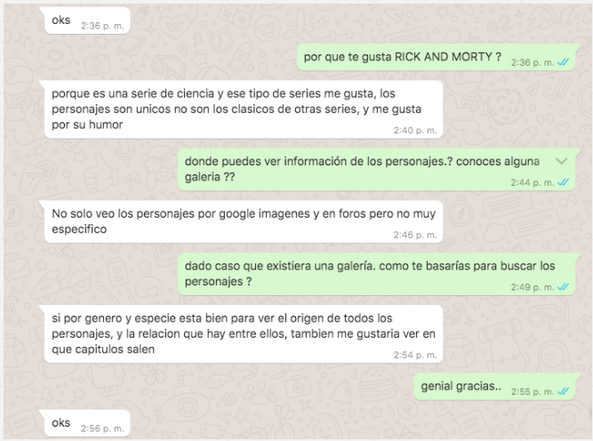

# Data Lovers

## Índice

* [1. Preámbulo](#1-preámbulo)
* [2. Resumen del proyecto](#2-resumen-del-proyecto)
* [3. Investigación UX](#3-investigación-ux)
***

## 1. Preámbulo

El humor negro, la ciencia ficción, la sátira y muchas escenas existencialistas son los ingredientes perfectos que hacen de “Rick y Morty” una de las series más atractivas en los últimos años y una opción que cada día está conquistado a más personas en el mundo.

“Rick y Morty” también contiene muchas escenas que parten de lo absurdo, de lo cruel y lo horrible, pero que gustan porque nadie las vio venir. “Rick siempre sabe más que todos en la audiencia. Todos los que ven el show han estado en esa posición”, recalcó Harmon. Además, a muchos de los televidentes les gusta Rick porque a pesar de su rebeldía y del egoísmo en su máxima expresión, al final siempre gana.

## 2. Resumen del proyecto

En este  ̈Data lovers ̈ seleccionamos el tema Rick and Morty, una serie de Netflix estadounidense animada para adultos. Nuestro principal Objetivo es construir una guía digital para que los usuarios puedan buscar y filtrar de forma efectiva los datos de los personajes, los capítulos, entre otros, para lograrlo realizamos entrevistas y definimos las necesidades de los usuarios.

## 3. Investigación UX

Primero elaboramos nuestro arquetipo y qué necesita saber o ver exactamente; luego construimos una interfaz que le va ayudar a interactuar y entender mejor esos datos. Nuestra página web permitirá visualizar la data, filtrarla, ordenarla

### Arquetipo:

### Problema a solucionar:

Debido a la gran magintud de data, en ocasiones se complica la  búsqueda de los diversos datos de los personajes y la serie de Rick y Morty, es por ello que se plantea una interfaz intuitiva y que satisfaga las necesidades de los usuarios.

### Objetivos:

Lograr que el usuario pueda buscar y filtrar el contenido con éxito.

* Que los filtros sean intuitivos para el usuario.
* Que la página sea usable.
* Que sea una interfaz amigable para el usuario.

### Userflow:

### Diseños de prototipos:

### Modelo de las entrevistas a usuarios (Prototipo de baja fidelidad):

* Duración: De 20 a 30 minutos
* Medios de comunicación: WhatsApp y Zoom.

#### Primera parte:

Presentación de nosotras y explicarle de que trata la entrevista. (Lenguaje casual). Preguntas para conocer al usuario:

* Háblanos un poco de ti
* ¿Cuéntanos a que te dedicas?
* ¿Qué haces en tus tiempos libres?
* ¿Cuál es tu hobbie?

#### Segunda parte:

* ¿Con qué asocias a Rick y Morty?
* ¿Por qué te gusta Rick y Morty?
* ¿Conoces alguna plataforma web que te brinde información adicional sobre la serie?¿Cuál es?
* ¿Qué datos de los personajes más te interesan saber?¿Por qué?
* ¿Con qué característica reconoces de tu personaje favorito?

#### Tercera parte:

Test de los prototipos de baja fidelidad.

Lista de Tareas (Prototipos):

1. Ver a todos los personajes de la serie.
2. Filtrar a los personajes por especies (Humanos y Aliens).
3. Ordenarlos de la A a la Z.
4. Buscar solo al personaje de Rick.
5. Buscar la lista de los capítulos de la serie.
6. Seleccionar el capítulo 1 de la primera temporada.

* En base al diseño mostrado ¿Cuándo utilizarías esta web?
* ¿Cómo te gustaría ordenar la lista de personajes en tu búsqueda?
* ¿Qué dato o elemento adicional te gustaría que aparezca?

### Entrevistados

Entrevistado 1: Erick Olivas
* Edad: 33
* Profesión: Lead UI
* Medio de entrevista zoom.
* Evidencia: Grabación de entrevista.

Entrevistado 2: Fares Akel
* Profesión: Front end
* Medio de entrevista zoom.
* Evidencia: Grabación de entrevista.

Entrevistado 3: Ximena Bedoya
* Profesión: Especialista en marketing
* Medio de entrevista zoom.
* Evidencia: Grabación de entrevista.

Entrevistado 4: Esau Ocrospoma
* Profesión: Ingeniero en Software.
* Medio de entrevista whatsApp.
* Evidencia: Screenshop.

### Conclusiones de las entrevistas:

* A los entrevistados les gusta Rick y Morty por su humor negro y por la temática científica y futurista.

* No han encontrado una web que le brinde información de los personajes y de las series, solo vídeos en Youtube.

* A los entrevistados les gustaría ver los capítulos dónde salen los personajes.

* Les gustaría tener información sobre datos curiosos de la serie.

### Resultados del test del prototipo:

* El flujo fue entendido por los usuarios.

* En la versión web cambiar la hamburguesa por un menú visible.

* Colocar los filtros visibles, pero sin que invadan la página web.

* Colocar boton ver mas (a partir de 10 perfiles del personaje).
