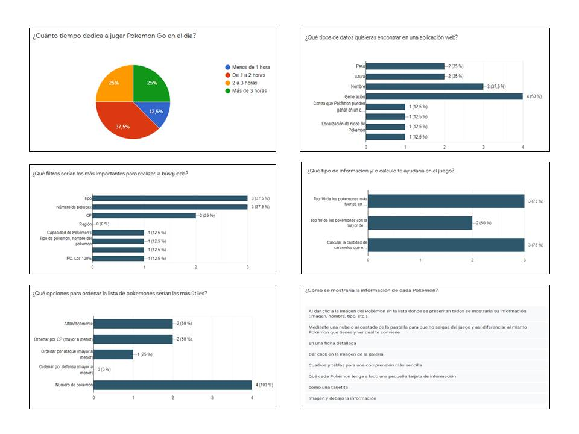
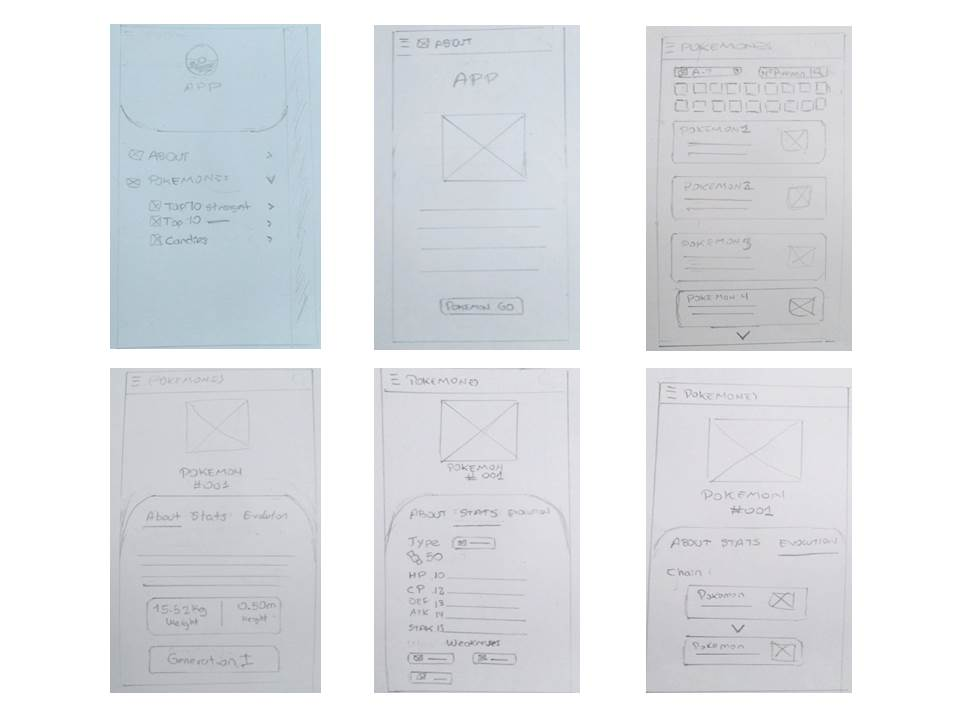
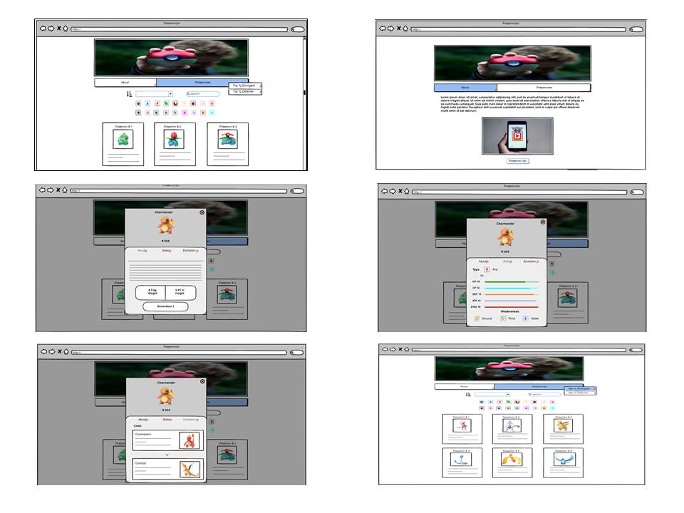
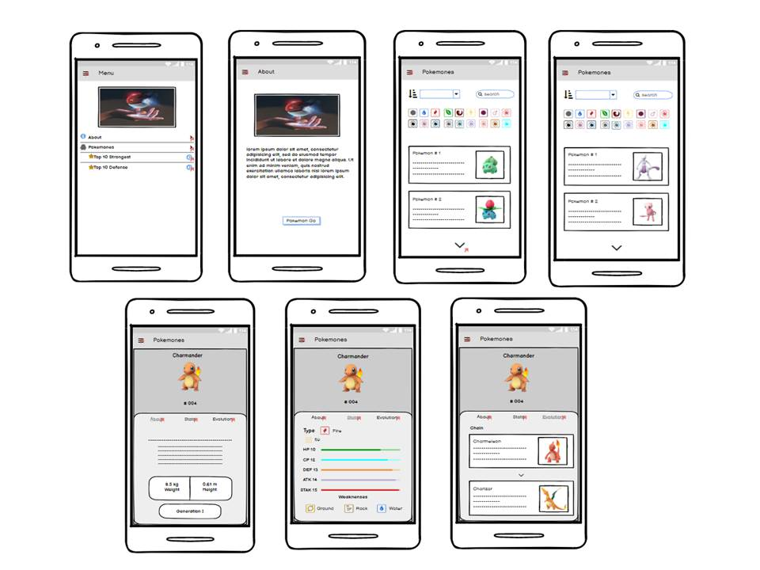
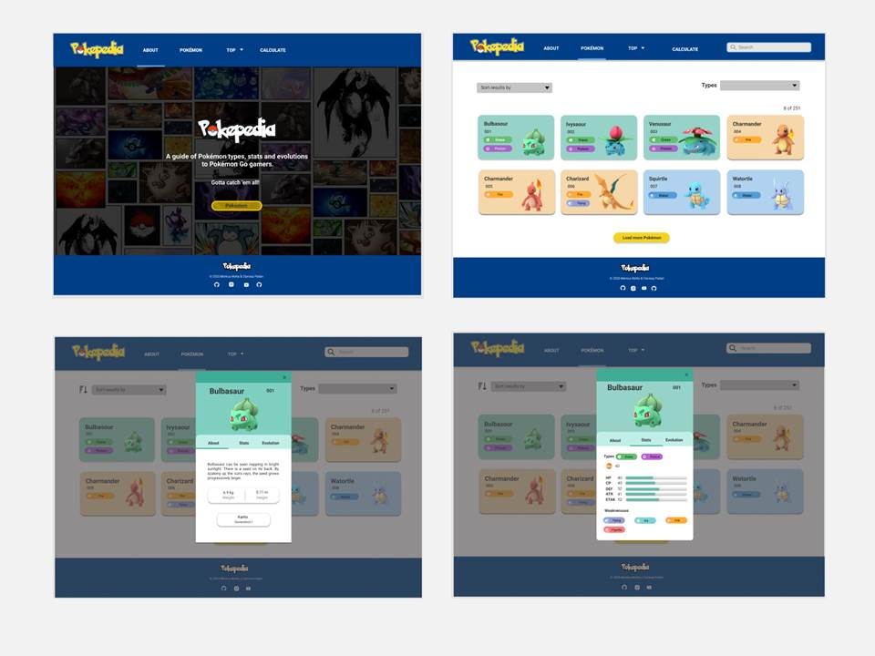
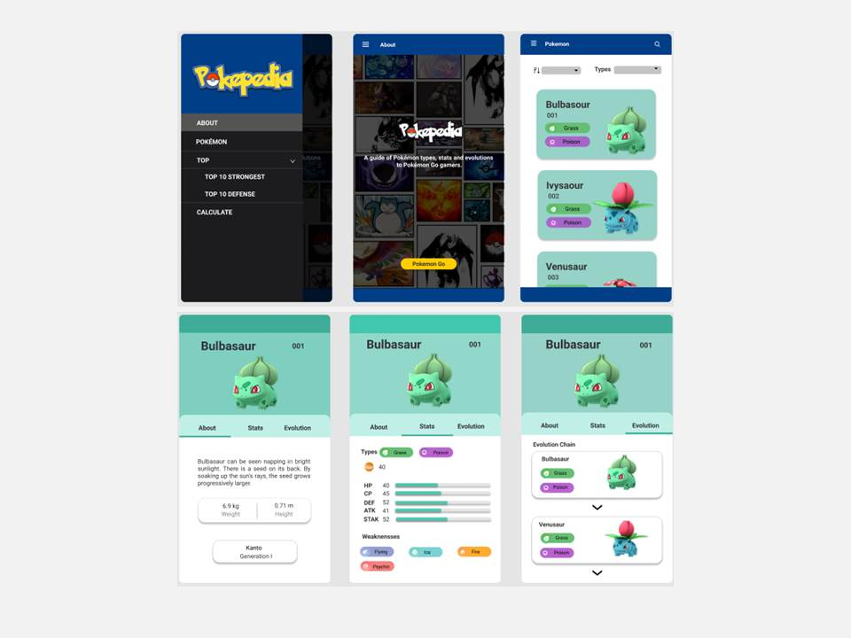

# Pokepedia

## Índice

* [1. Definición del producto](#1-preámbulo)
* [2. Resumen del proyecto](#2-resumen-del-proyecto)
* [3. Investigación UX](#3-producto-final)

***

## 1. Definición del producto

Pokepedia es una aplicación web que contiene información relevante sobre distintos Pókemon, y se encuentra dirigida a jugadores de Pókemon Go. Esta es una guía que permite al usuario hallar datos con respecto a estadísticas básicas, tipos y evoluciones que serán de gran ayuda durante las batallas que realicen como jugadores recurentes del aplicativo Pókemon Go.

## 2. Resumen del proyecto

Pokémon Go es un aplicativo móvil que hoy en día es muy usuado por jóvenes, por lo cual se optó por el desarrollo de una plataforma que permita a los usuarios obtner información de los Pókemon de una manera sencilla y práctica. 
Para el desarrollo de este proyecto se trabajó bajo la metodología SCRUM, por lo cual, al final de cada sprint se presentó una funcionalidad tomando en cuenta los requerimietnos de las historias de usuario. Asimismo, desde el primer prototipo los usuarios iteraron con el producto propuesto y brindaron una retroalimentación constante en cada sprint.

## 3. Investigación UX
### Usuarios y objetivos del producto

El público objetivo de esta aplicación son personas mayores de edad, jugadores recurentes de Pókemon Go, quienes dedican al menos una hora diaria a este juego, por cual necesitan conocer datos específicos de cada Pókemon para tener en cuenta cuáles emplear en las batallas.

Objetivos:
* Brindar una plataforma digital que permita obtener los datos más significativos para los jugadores de Pókemon Go.
* Ser una plataforma intuitiva y adaptable a las necesidades del usuario.

### Problemas y/o necesidades de los usuarios

Para conocer las necesidades más importantes de los usuarios, se realizó una [encuesta](https://forms.gle/jJhJtrdahqtkkDQs8) compuesta de 14 preguntas, las cuales permitieron analizar cuáles eran los requerimientos más importantes de los usuarios. Por esta razón, se tomó en cuenta cuatro puntos:
* De qué forma visualizar a todos los pokemones. 
* De qué forma visualizar la información de cada pokémon. 
* El uso de filtros para realizar la búsqueda.
* Principales características de navegación  y diseño visual que requiera el usuario.

Luego de realizar las encuestas, se obtuvieron resultados cuantitativos y cualitativos, los cuáles permitieron determinar qué datos son los de mayor utilidad para el usuario como jugadores de Pókemon go y, que aspectos de navegación y diseño visual permitirían una mejor experiencia en la plataforma propuesta.

Muestra de los resultados

Con los resultados obtenidos, se concluyó que los  usuarios requieren una plataforma intuitiva, que muestre la lista de Pókemon de una manera agradable visualmente. Asimismo, filtros para el tipo de Pókemon, una lista desplegable que permita ordenar la data, principalmente, por número de Pokedex. Todo ello, con la finalidad de poder ubicar con mayor facilidad a los Pókemon según sus requerimientos en el momento que utilizan la aplicación. 

### Historia de usuario
Al desarrollar el proyecto bajo la metodología SCRUM, se realizaron las historias de usuario empleando la plataforma Trello. En estas historias, se describieron los prinicpales requerimientos de los usuarios.

Historia de usuario 1
    Yo como: jugador de Pokemon Go,
    Quiero: visualizar al inicio una descripción de la página,
    Para: saber el objetivo de la aplicación web.

Historia de usuario 2
    Yo como: jugador de Pokémon Go.
    Quiero: visualizar todos los pokemones,
    Para: saber la cantidad de Pókemon que hay en la aplicación web.

Historia de usuario 3
    Yo como: jugador de Pokémon Go.
    Quiero: sisualizar las características del Pokémon.
    Para: saber cuál utilizar en las batallas.

[Historias de usuario en Trello](https://trello.com/b/z3EoDD8J/data-lovers-planning)

### Primer prototipo
Se realizó el primer prototipo a lápiz.

### Test de usabilidad
Para realizar el test de usablidad se realizó un segundo prototipo en Balsamiq, en el cual el usuario pudo iterar con las versiones desktop y mobile. Se tuvo estas iteraciones vía Zoom, por lo cual mientras el usuario probaba los prototipos, nos daba a conocer cómo estaba siendo su experiencia y que aspectos permitiran una mejor navegación. Asimismo, se envió el enlace del prototipo para que otros usuarios nos brinden su puntos de mejora luego de la iteración.

* Problemas detectados:
    - Las opciones de ambos Top deberían estar integrados en una sección aparte de la opción Pokémon.
    - La cantidad de botones de los tipos de Pókemon son muchos, por lo cual se recomendó emplear una lista desplegable que contenga todas las opciones de los tipos.
    - Omitir la imagen propuesta como inicio de la página, en su lugar colocar un encabezado que contenga las opciones del menú.
    - El botón de la sección About no debe redirigir al usuario a otra página, por lo cual se cambió la redirección a la sección Pókemon.

Luego del feedback recibido se procedió a realizar el prototipo de alta fidelidad en [Figma](https://www.figma.com/file/IixUxaI02Dbk5NodKPla6j/Pokemon?node-id=0%3A1).

