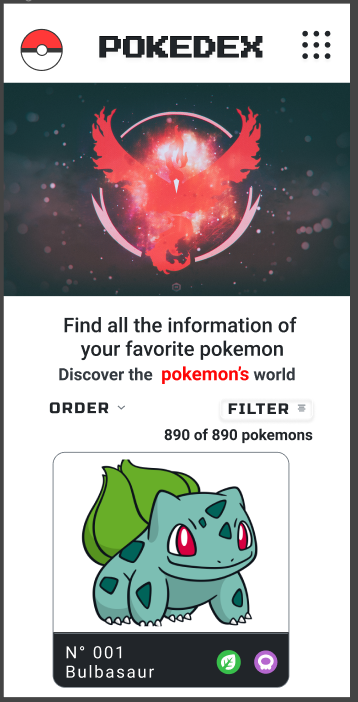

#  Data Lovers - POKEDEX 

## Índice

* [1. Preámbulo](#1-preámbulo)
* [2. Resumen del proyecto](#2-resumen-del-proyecto)
* [3. Historias de usuario](#3-historias-de-usuario)
* [4. Investigación  UX](#3-investigación-ux)
* [5. Autoras](#5-autoras)

***

## 1. Preámbulo

### Datos
Para este proyecto trabajamos con un set de datos en js y también en formato JSON, ambos archivos contienen información de 251 pokemones.

### Pokedex
Con la data que manejamos, intentamos hacer una especie de [*POKEDEX*](https://www.pokemon.com/el/pokedex/), la Pokédex, en el mundo ficticio de Pokémon, es una enciclopedia portátil de alta tecnología que los Entrenadores Pokémon llevan consigo para registrar las fichas de todas las diversas especies Pokémon con las que se encuentran durante su viaje como entrenadores. 

## 2. Resumen del proyecto

En este proyecto hemos construido una _página web_ que con la data de 251 pokemones puede ofrecerle a los usuarios lo siguiente: 
### a. Visualizar 
En el inicio podemos visualizar a todos los pokemones con algunos datos básicos como la _imágen, número y tipo._ Así mismo, tenemos una caja de búsqueda para que el usuario pueda ingresar el nombre o número del pokemon que desee encontrar; por último, tenemos dos botones, el de [ORDER](###-b.-Ordenar) y [FILTER](###-c.-Filtrar) con los que el usuario puede interactuar.

Al darle click a la imagen de cualquier pokemón nos llevará a otra página donde podremos ver más información del pokemon al que le dimos click, esta información es requerida por usuarios con un poco más de experiencia en el anime o en Pokemon GO. En esta parte del proyecto, tenemos 3 secciones, **Overview** que muestra datos generales, **Stats** que muetra una tabla estadística con puntos de ataque, defensa, etc. y **Abilities** que muestra datos de resistencia, debilidades, etc. 

### b. Ordenar

En el botón **ORDER**, tenemos 4 opciones: ordenar por *número* de forma ascendente y descendente y de la misma manera con el *nombre* del pokemon.

### c. Filtrar 

En el botón **FILTER**, tenemos dos secciones: la primera de *tipo* que nos permite tomar 1 o 2 filtros, y la segunda sección de *región* que nos permite tomar uno entre Kanto o Johto.

## 3. Historias de Usuario

## 4. Investigación UX

### Usuarios

Los usuarios objetivos para este proyecto son personas que tienen el interés de saber algunos datos básicos - intermedios de los pokemones de la región *Kanto* y *Johto* . 

Estos usuarios en la actulidad tienen muy poco conocimiento sobre el anime, quieren empezar a jugar pokemon Go o son nuevos usuarios de este juego.

### Objetivos del usuario

El usuario utiliza la página web para tener conocimiento de datos generales de uno o varios pokemones, así como ver algunas de sus habilidades, puntos de ataque, etc.

### Prototipos en papel

### Wireframes Mobile

### Prototipos de Alta Fidelidad

#### Mobile

* Inicio

* Pokemon

#### Desktop

* Inicio

* Pokemon

## 5. Autoras

Diseño UX y desarrollo por: 

* [Sharon Huaman](https://github.com/SharonHQ)
* [Vivian Britez](https://github.com/VivianBritez)