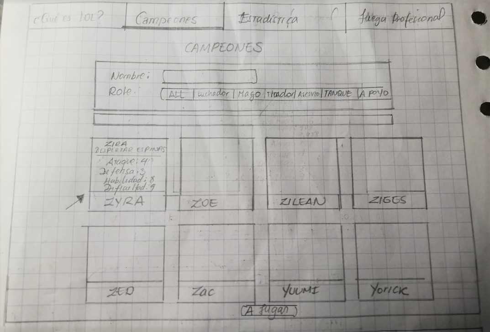
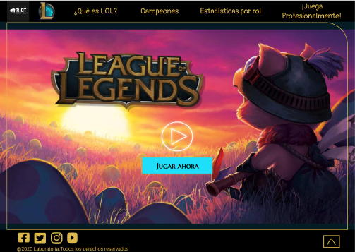
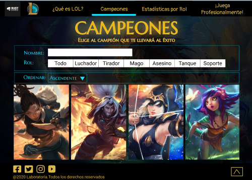

# Data Lovers - League of Legends

## Índice

* [1. Preámbulo](#1-preámbulo)
* [2. Resumen del proyecto](#2-resumen-del-proyecto)
* [3. Desarrollo del Proyecto](#3-desarrollo-del-proyecto)
* [4. Contenido de referencia](#4-contenido-de-referencia)
* [5. Checklists](#5-checklist)
* [6. Autores](#6-autores)

***

## 1. Preámbulo :loudspeaker:

**League of Legends** es uno de los videojuegos MOBA _(multijugador de arena de batalla en línea)_ más populares en todo el mundo, llegando a considerarse un e-sport de excelencia con competencias a nivel mundial, donde los mejores equipos de cada continente batallan por conseguir el cuantioso premio de hasta 1.7 millones de dólares.

Pese a su gran fama y accesibilidad, aún hay mucha gente que no se atreve a probar el juego por diversos factores, entre ellos el bombardeo de información no ordenada que confunde a los usuarios y finalmente desisten en jugar.

## 2. Resumen del proyecto :clipboard:

Este proyecto consiste en construir una página web que permita al usuario obtener información breve pero detallada sobre el juego League of Legends, así como filtrar, ordenar y ver los cálculos más importantes de los personajes (llamados **“Campeones”**) para que el usuario tenga mayor facilidad al momento de escoger a su campeón.

Inicialmente se entrevistó a 5 jugadores con experiencia en LoL para recibir inputs y tomarlos en cuenta en la interfaz. También se encuestó a usuarios sin experiencia en Lol para conocer qué tipo de información valorarían más, ya que ellos son el público objetivo. 

Conforme se avanzó con el prototipo, se fue testeando con otros usuarios, midiendo su experiencia, hasta conseguir un diseño ideal. 

En la elaboración del producto, se extrajo la data desde [League of Legends - Challenger leaderboard](src/data/lol/lol.json) y se utilizó el lenguaje Javascript, HTML y CSS. El resultado es una web informativa, dinámica, directa y responsive para mobile y desktop.

## 3.	Desarrollo del Proyecto :wrench:

### 3.1. ¿Cómo empezamos? 
#### ENTREVISTAS :mag_right:

Se hicieron entrevistas vía telefónica a 5 usuarios con experiencia en el juego League of Legends.

#### Objetivo de la entrevista
Conocer qué tipo de información es necesaria para jugar LOL.

#### Introducción
Hola, _entrevistado_, esta entrevista es para conocer sobre tu experiencia con el juego League of Legends. 
Nada de lo que digas está bien o mal, ni vamos a juzgarte por eso. Si en algún momento decides que no quieres continuar con la entrevista, puedes manifestarlo, no hay ningún problema.

#### Información de los usuarios
* Nombre
* Edad
* Condición: estudiante, trabajador, etc.
* Distrito en que vive

#### Preguntas 

- **LOL Roundabout**

1.	¿Qué tan seguido juegas  LOL?
2.	¿Desde qué dispositivo juegas LOL?
3.	¿Conoces alguna página web o aplicación informativa de LOL que te haya ayudado a jugar?
4.	¿Qué te gusta y/o disgusta de esta página web o aplicación?

- **Playing LOL Roundabout I: Beginning**

5.	¿Qué te hubiera gustado saber de LOL para entender mucho mejor el juego?

- **Playing LOL Roundabout II: Starting**

6.	¿Cuáles son los criterios que tomas para elegir a tu campeón?
7.	 De todo lo que hemos conversado, ¿hay algo que te gustaría conocer o añadir en una página web sobre LOL?

#### Resultados de las entrevistas:
*	A los jugadores de Lol les interesa saber de manera general en qué consiste cada rol, ya que de acuerdo a esto escogen las zonas y los personajes.
*	Los jugadores de Lol necesitan saber qué campeones aplican a cada rol para armar estrategias en equipo.
*	Les fue difícil encontrar una buena plataforma web que les brinde información completa del juego.
*	Les gustaría tener mayor información sobre las competencias a nivel internacional.

#### ENCUESTAS :mag_right:

### 3.2. ¡Manos a la obra!

#### PROTOTIPO DE BAJA FIDELIDAD :art:

Con las entrevistas y encuestas realizadas, pasamos a diseñar el prototipo de baja fidelidad:

> Estos fueron los primeros diseños del **home** y la página **Campeones**. Se recibió el feedback de acortar los filtros, ya que causaban confusión y nos quedamos solo con los siguientes:

> Se tuvo la idea de añadir una ventana modal para mostrar las estadísticas por campeón seleccionado. 

> En el feedback se comentó que la idea era buena, pero les gustaría ver este detalle en una ventana aparte, por lo que se reemplazó la ventana **Novedades** por **Estadísticas**. También se pidió añadir un botón de **Jugar**:

> Con la nueva pestaña de Estadísticas, se pensó colocar información resumida de cada campeón en una tarjeta giratoria que permita ver la imagen en una cara y la información en otra:

> En la pestaña Estadística se pensó colocar íconos de cada rol y que al dar click aparezca una ventana modal con cálculos promedio por rol:

> También se aumentó información general del juego. Estas ideas fueron aceptadas en el feedback:

#### PROTOTIPO DE ALTA FIDELIDAD :art:

Trabajamos con la herramienta de diseño visual [Figma](https://www.figma.com/), siguiendo los fundamentos de **visual design** (balance, contraste, alineación y repetición para mantener el orden).

**PARA DESKTOP:** :computer:

**PARA MOBILE:** :iphone:

#### HISTORIAS DE USUARIO :pushpin:

Con el prototipo listo, se pasó a crear las **Historias de Usuario**, siguiendo el marco de trabajo **Scrum** que incluye también eventos como el Sprint Planning, Sprint Goal, Daily Scrum, Sprint Review y Sprint Retrospective.

* **Historia de Usuario 1:**
Como jugador de LOL quiero saber de qué trata el juego para tener una noción de la temática del juego.

Criterios de Aceptación:
- El usuario debe visualizar la pantalla de inicio.
- El usuario puede seleccionar distintos botones que lo deriven a las otras secciones de la página: ¿Qué es LOL?, Campeones, Juega Profesionalmente y Estadísticas.
- El usuario puede seleccionar el botón de Jugar. 

Definición de terminado:
- Estructurar HTML semántico.
- El diseño debe ser similar al prototipo.
- La página debe ser responsive.
- Usar Eslint para corregir errores de código.
- Subir a GitHub.

El feedback que se recibió fue el de añadir botones que nos direccionen a las páginas oficiales de LoL y Riot Games, así como añadir más efecto visual.

* **Historia de Usuario 2:**
Como jugador de LOL quiero visualizar a los campeones disponibles según su rol para ver qué personaje me agrada y conviene más en cada rol.

Criterios de Aceptación:
- El usuario puede seleccionar el rol de su preferencia.
- El usuario puede visualizar los campeones que aplican a determinado rol.

Definición de Terminado:
- Se extrae las imágenes y la información de los campeones desde la data.
- El filtrado funciona.
- Realizar test de usabilidad (1o 2 usuarios).

El feedback que se recibió fue poner un fondo más llamativo y colocar alguna flecha que permita regresar a la parte superior de la página porque hay muchos campeones que hacen la página muy extensa.

* **Historia de Usuario 3:**
Como jugador de LOL quiero ordenar a los campeones disponibles según su nombre para encontrarlos rápidamente.

Criterios de Aceptación:
- El usuario puede ordenar los campeones según nombre.
- El usuario puede ver la imagen e información de los campeones.

Definición de Terminado:
- La función de orden es efectiva.
- Realizar test de usabilidad (1o 2 usuarios).

* **Historia de Usuario 4:**
Como jugador de LOL quiero conocer las estadísticas y descripción de cada rol para escoger el rol que más me convenga en la batalla.

Criterios de Aceptación:
- El usuario puede conocer los roles disponibles para los campeones.
- El usuario puede conocer cuantitativamente las principales fortalezas de cada rol.

Definición de Terminado:
- La interfaz debe mostrar los roles existentes.
- La interfaz debe mostrar una ventana modal con el promedio de estadísticas.
- La interfaz es responsive.

* **Historia de Usuario 5:**
Como jugador de LOL quiero obtener información sobre las competencias para proyectarme como jugador profesional.

Criterios de Aceptación:
- El usuario puede ver las competencias que existen en las distintas partes del mundo.
- El usuario puede conocer los requisitos para participar, entre otras características de las competencias.

Definición de Terminado:
- La interfaz debe mostrar información general de las competencias.
- La interfaz debe mostrar un video resumen de las competencias.

## 4. Contenido de referencia :paperclip:

#### Diseño de experiencia de usuario (User Experience Design)

* Investigación con usuarios / entrevistas
* Principios de diseño visual

#### Desarrollo Front-end

* Unidad de testing en curso de JavaScript en LMS.
* Unidad de arreglos en curso de JavaScript en LMS.
* Unidad de objetos en curso de JavaScript en LMS.
* Unidad de funciones en curso de JavaScript en LMS.
* Unidad de DOM en curso de Browser JavaScript en LMS.
* [Array en MDN](https://developer.mozilla.org/es/docs/Web/JavaScript/Referencia/Objetos_globales/Array)
* [Array.sort en MDN](https://developer.mozilla.org/es/docs/Web/JavaScript/Referencia/Objetos_globales/Array/sort)
* [Array.map en MDN](https://developer.mozilla.org/es/docs/Web/JavaScript/Referencia/Objetos_globales/Array/map)
* [Array.filter en MDN](https://developer.mozilla.org/es/docs/Web/JavaScript/Referencia/Objetos_globales/Array/filter)
* [Array.reduce en MDN](https://developer.mozilla.org/es/docs/Web/JavaScript/Referencia/Objetos_globales/Array/reduce)
* [Array.forEach en MDN](https://developer.mozilla.org/es/docs/Web/JavaScript/Referencia/Objetos_globales/Array/forEach)
* [Object.keys en MDN](https://developer.mozilla.org/es/docs/Web/JavaScript/Referencia/Objetos_globales/Object/keys)
* [Object.entries en MDN](https://developer.mozilla.org/es/docs/Web/JavaScript/Referencia/Objetos_globales/Object/entries)
* [Fetch API en MDN](https://developer.mozilla.org/en-US/docs/Web/API/Fetch_API)
* [json.org](https://json.org/json-es.html)
* [expressions-vs-statements](https://2ality.com/2012/09/expressions-vs-statements.html)
* [expresión vs sentencia](https://openclassrooms.com/en/courses/4309531-descubre-las-funciones-en-javascript/5108986-diferencia-entre-expresion-y-sentencia)
* [datos atómicos vs datos estructurados](https://www.todojs.com/tipos-datos-javascript-es6/)
* [Modulos: Export](https://developer.mozilla.org/es/docs/Web/JavaScript/Referencia/Sentencias/export)
* [Modulos: Import](https://developer.mozilla.org/es/docs/Web/JavaScript/Referencia/Sentencias/import)

#### Herramientas

* Editor en texto: [Code](https://code.visualstudio.com/).
* Herramienta de diseño visual: [Figma](https://www.figma.com/).
* Repositorio de imágenes: [Imgur](https://imgur.com/).
* Web de íconos diversos: [Flaticon](https://www.flaticon.com/).
* [Git](https://git-scm.com/)
* [GitHub](https://github.com/)
* [GitHub Pages](https://pages.github.com/)
* [Node.js](https://nodejs.org/)
* [Jest](https://jestjs.io/)

#### Organización del Trabajo

* [Historias de Usuario](https://www.youtube.com/watch?v=ky6wFiF5vMk&t=344s).
* [Cómo dividir H.U.](https://www.youtube.com/watch?v=Ueq786iZ30I&t=341s)
* [Guía para Data Lovers](https://docs.google.com/presentation/d/e/2PACX-1vQhx9D36NjpH-Daea-ITPUDUzNL8ZiNAprq_7b5PSUrfutk45tEtaOLz2lmd8f54_5jX1hypDM8f8SM/pub?start=false&loop=false&delayms=60000)

## 5. Checklist :ballot_box_with_check:

* [ ] Usa VanillaJS.
* [ ] No hace uso de `this`.
* [ ] Pasa linter (`npm run pretest`)
* [ ] Pasa tests (`npm test`)
* [ ] Pruebas unitarias cubren un mínimo del 70% de statements, functions y
  lines y branches.
* [ ] Incluye _Definición del producto_ clara e informativa en `README.md`.
* [ ] Incluye historias de usuario en `README.md`.
* [ ] Incluye _sketch_ de la solución (prototipo de baja fidelidad) en
  `README.md`.
* [ ] Incluye _Diseño de la Interfaz de Usuario_ (prototipo de alta fidelidad)
  en `README.md`.
* [ ] Incluye link a Zeplin en `README.md`.
* [ ] Incluye el listado de problemas que detectaste a través de tests de
  usabilidad en el `README.md`.
* [ ] UI: Muestra lista y/o tabla con datos y/o indicadores.
* [ ] UI: Permite ordenar data por uno o más campos (asc y desc).
* [ ] UI: Permite filtrar data en base a una condición.
* [ ] UI: Es _responsive_.

## 6. Autores :hearts:
* Castro Alva, Ruth Smith.
* Flores Calla, Verónica.